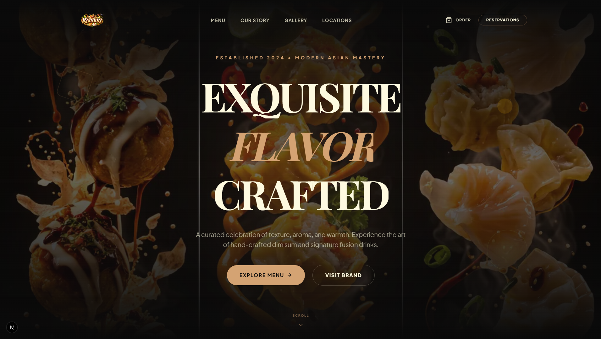

# 🥢 KAISEKI | Modern Asian Luxury



> **"Experience the Art of Modern Asian Dining where Tradition Meets Contemporary Sophistication."**

**KAISEKI** is a premium, high-end web experience for an elite Asian-fusion restaurant chain. Built with cutting-edge technologies like **Next.js 15**, **GSAP**, and **Framer Motion**, it delivers a cinematic dining exploration through immersive 3D-like animations, smooth kinetic scrolling, and architectural layouts.

---

## ✨ Key Features

- **🏆 Immersive Storytelling**: A cinematic brand story section that uses GSAP and ScrollTrigger for a world-class scrolling experience.
- **🗺️ Global Presence**: An interactive locations module featuring San Francisco, London, Tokyo, and Hong Kong with real-time status and atmospheric visuals.
- **🍣 Signature Menu Showcase**: A beautifully curated digital menu highlighting premium dishes with elegant typography and high-fidelity imagery.
- **📜 Fluid Motion (Lenis)**: Integrated high-performance smooth scrolling for a "weightless" feel across all devices.
- **🥂 Reservation System**: A sleek, form-validated reservation module built with React Hook Form and Zod for a frictionless booking experience.
- **📱 Responsive Excellence**: A "mobile-first luxury" approach, ensuring the premium feel is maintained from ultra-wide desktops to smartphones.

---

## 🛠️ Tech Stack

### CORE ENGINE
*   **Framework**: [Next.js 15+](https://nextjs.org/) (App Router)
*   **Runtime**: [React 19](https://react.dev/)
*   **Language**: [TypeScript](https://www.typescriptlang.org/)

### DESIGN & MOTION
*   **Styling**: [Tailwind CSS 4](https://tailwindcss.com/)
*   **Motion Framework**: [Framer Motion](https://www.framer.com/motion/)
*   **Advanced Animations**: [GSAP](https://greensock.com/gsap/) (GreenSock)
*   **Smooth Scroll**: [Lenis](https://lenis.darkroom.engineering/)
*   **Icons**: [Lucide React](https://lucide.dev/)

### ARCHITECTURE
*   **Forms**: [React Hook Form](https://react-hook-form.com/)
*   **Validation**: [Zod](https://zod.dev/)
*   **Components**: Atomic Design structure

---

## 🚀 Getting Started

### Prerequisites

*   **Node.js**: 18.x or later
*   **Package Manager**: `npm`, `pnpm`, or `bun`

### Installation

1.  **Clone the repository**:
    ```bash
    git clone https://github.com/USERNAME/kaiseki.git
    cd kaiseki
    ```

2.  **Install dependencies**:
    ```bash
    npm install
    # or
    pnpm install
    ```

3.  **Run development server**:
    ```bash
    npm run dev
    ```

4.  **Open the local environment**:
    Go to [http://localhost:3000](http://localhost:3000)

---

## 🏗️ Folder Structure

```text
kaiseki/
├── public/                # Static assets (Images, Videos, Fonts)
│   └── assets/branding/   # High-res brand visuals
├── src/
│   ├── app/               # Next.js Pages & Layouts
│   ├── components/        # Reusable UI Components
│   │   ├── common/        # Navbar, Footer, Providers
│   │   └── sections/      # Home sections (Hero, Menu, etc.)
│   ├── styles/            # Global styling systems
│   └── lib/               # Utility functions & hooks
└── tailwind.config.ts     # Design tokens & theme
```

---

## 🥂 Contribution & Support

We welcome contributions to elevate the luxury experience. 

1.  **Fork** the project
2.  Create your **Feature Branch** (`git checkout -b feature/PremiumTouch`)
3.  **Commit** your changes (`git commit -m 'Add premium glassmorphism'`)
4.  **Push** to the branch (`git push origin feature/PremiumTouch`)
5.  Open a **Pull Request**

---

## 📜 License

Distributed under the **MIT License**. See `LICENSE` for more information.

<p align="center">
  <br />
  Designed with ❤️ by <b>Kaiseki Digital Atelier</b>
</p>
